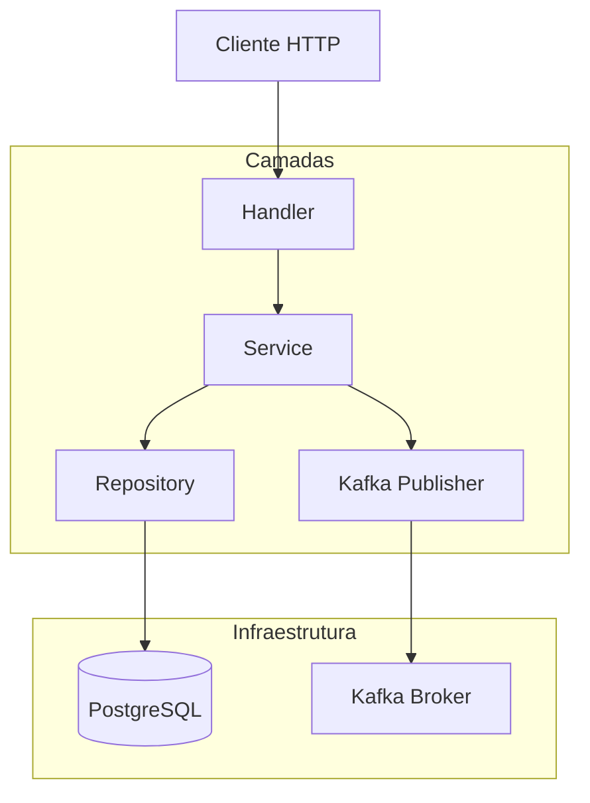

# POC Test Pyramid

Proof of Concept para demonstrar a pirâmide de testes em Go com PostgreSQL e Kafka.

## Pré-requisitos

- Docker e Docker Compose
- Go 1.24.1+
- VS Code com extensão Dev Containers (opcional)

## Como executar

### 1. Subir infraestrutura
```bash
make up
```

### 2. Executar aplicação
```bash
make run
```

### 3. Parar tudo
```bash
make down
```

## Desenvolvimento com Dev Containers

Para um ambiente de desenvolvimento consistente, use Dev Containers:

1. Abra o projeto no VS Code
2. Instale a extensão "Dev Containers"
3. Clique em "Reopen in Container" quando aparecer o popup
4. Ou use `Cmd+Shift+P` → "Dev Containers: Reopen in Container"

Veja [DEVCONTAINER.md](DEVCONTAINER.md) para mais detalhes.

## Testes

### Testes Unitários
```bash
make test-unit
```

### Testes de Integração
```bash
make test-integration
```

### Todos os Testes
```bash
make test
```

## Fluxo da Aplicação



## API Endpoints

### POST /discount
```json
{
  "price": 100.0,
  "discount": 10.0
}
```

### GET /discount?price=100&discount=10

## Estrutura do projeto

- `main.go` - Ponto de entrada da aplicação
- `service/` - Camada de lógica de negócio
- `handler/` - Handlers da API REST
- `repository/` - Camada de persistência
- `messaging/` - Publisher do Kafka
- `model/` - Modelos de dados
- `config/` - Configurações
- `integration_test/` - Testes de integração
- `.devcontainer/` - Configuração do Dev Container
- `docker-compose.yml` - Infraestrutura local

## Infraestrutura

- **PostgreSQL**: Banco de dados na porta 5432
- **Kafka**: Message broker na porta 9092 (KRaft mode)
- **Kafka UI**: Interface web na porta 8090
